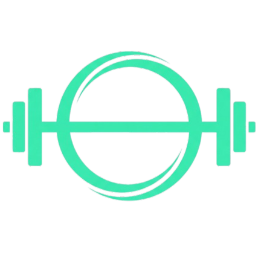

<div align="center">



# FitnesSync 💪

**App móvil de entrenamiento personalizado según tu somatotipo y objetivo físico.**

[](https://reactjs.org/)
[](https://ionicframework.com/)
[](https://nodejs.org/)
[](https://www.postgresql.org/)
[](https://www.typescriptlang.org/)
[](LICENSE)

[Descargar App](FitnesSync.apk)

</div>

---

## 🎯 Acerca del Proyecto

**FitnesSync** es una aplicación móvil de entrenamiento que genera rutinas y planes nutricionales personalizados según el **somatotipo** (ectomorfo, mesomorfo, endomorfo) y el **objetivo físico** del usuario (ganar masa muscular o perder grasa).

El usuario se registra, completa un onboarding de 2 pasos, y recibe de forma inmediata:
- Un **plan de entrenamiento semanal** adaptado a su equipamiento (pesas, bandas o peso corporal)
- Un **plan nutricional** con distribución de macros y menú de ejemplo
- Seguimiento de sesiones completadas con **racha semanal**

---

## ✨ Características

- 🔐 **Autenticación** con registro, login y JWT
- 🧬 **Onboarding** de 2 pasos: objetivo + somatotipo
- 🏋️ **Catálogo de ejercicios** filtrable por grupo muscular y equipamiento
- 📅 **Rutina semanal personalizada** con días configurables y vista expandible por ejercicio
- 🥗 **Plan nutricional** con macros calculados (proteína, carbos, grasas) y menú diario
- 👤 **Perfil** con edición de nombre, cambio de contraseña y estadísticas
- 📊 **Estadísticas**: sesiones totales y racha semanal
- 🌙 **Diseño oscuro** moderno, consistente en todos los módulos

---

## 🛠 Stack Tecnológico

### Frontend
| Tecnología | Versión | Uso |
|---|---|---|
| React | 18 | UI framework |
| Ionic Framework | 7 | Componentes móviles |
| TypeScript | 5 | Tipado estático |
| Tailwind CSS | 4 | Utilidades de estilos |
| CSS Variables | — | Estilos por componente y theming |
| React Router | 6 | Navegación |
| Lucide React | — | Iconografía minimalista |

### Backend
| Tecnología | Versión | Uso |
|---|---|---|
| Node.js | 20 LTS | Runtime |
| Express | 4 | Framework HTTP |
| PostgreSQL | 16 | Base de datos |
| JWT | — | Autenticación |
| bcrypt | — | Hash de contraseñas |
| pg (node-postgres) | — | Driver PostgreSQL |

---

### Pantallas principales

| Login | Dashboard | Plan Semanal |
|---|---|---|
|  |  |  |

| Catálogo | Nutrición | Perfil |
|---|---|---|
|  |  |  |

---

## 🏗 Arquitectura

```
FitnesSync
├── Frontend (Ionic + React)   → Puerto 5173 (dev) / Build estático
│     └── Consume REST API
│
└── Backend (Express + Node)   → Puerto 3000
      └── PostgreSQL            → Puerto 5432
```

### Flujo de autenticación

```
Usuario → POST /auth/login → JWT Token → Header Authorization → Rutas protegidas
```

---

## 🚀 Instalación y Setup Local

### Prerrequisitos

Asegúrate de tener instalado:

- [Node.js](https://nodejs.org/) v20 LTS o superior
- [npm](https://www.npmjs.com/) v9+
- [PostgreSQL](https://www.postgresql.org/) v16
- [Ionic CLI](https://ionicframework.com/docs/cli) (para el frontend)

```bash
npm install -g @ionic/cli
```

---

### 1. Clonar el repositorio

```bash
git clone https://github.com/tu-usuario/fitnessync.git
cd fitnessync
```

---

### 2. Configurar la base de datos

Conéctate a PostgreSQL y crea la base de datos:

```sql
CREATE DATABASE fitnessync_db;
```

Ejecuta el esquema inicial:

```bash
psql -U postgres -d fitnessync_db -f backend/database/schema.sql
```

*(Opcional) Carga datos de ejemplo:*

```bash
psql -U postgres -d fitnessync_db -f backend/database/seed.sql
```

---

### 3. Configurar el Backend

```bash
cd backend
npm install
```

Crea el archivo `.env` (ver [Variables de Entorno](#variables-de-entorno)):

```bash
cp .env.example .env
# Edita .env con tus valores
```

Inicia el servidor:

```bash
# Desarrollo (con nodemon)
npm run dev

# Producción
npm start
```

El backend corre en `http://localhost:3000`

---

### 4. Configurar el Frontend

```bash
cd frontend
npm install
```

Crea el archivo `.env`:

```bash
cp .env.example .env
# Ajusta VITE_API_URL si tu backend no corre en localhost:3000
```

Inicia la app:

```bash
# Modo web (desarrollo)
ionic serve

# Build de producción
ionic build

# Sincronizar plataformas nativas (Capacitor)
npx cap sync android
npx cap sync ios

# Ejecutar en dispositivo Android (Requiere Android Studio)
ionic cap run android

# Ejecutar en dispositivo iOS (Requiere Xcode)
ionic cap run ios
```

La app corre en `http://localhost:5173`

---

## 🔐 Variables de Entorno

### Backend — `/backend/.env`

```env
# Servidor
PORT=3000
NODE_ENV=development

# Base de datos
DB_HOST=localhost
DB_PORT=5432
DB_NAME=fitnessync_db
DB_USER=postgres
DB_PASSWORD=tu_password

# JWT
JWT_SECRET=tu_clave_secreta_muy_larga_y_segura
JWT_EXPIRES_IN=7d
```

### Frontend — `/frontend/.env`

```env
VITE_API_URL=http://localhost:3000/api
```

---

## 📡 Documentación de la API

**Base URL:** `http://localhost:3000/api`

> Las rutas marcadas con 🔒 requieren el header `Authorization: Bearer <token>`

---

### Auth

#### `POST /auth/register`
Registra un nuevo usuario.

**Body:**
```json
{
  "nombre": "Juan Pérez",
  "email": "juan@correo.com",
  "password": "miPassword123"
}
```

**Respuesta 201:**
```json
{
  "mensaje": "Usuario registrado correctamente",
  "usuario": {
    "id": 1,
    "nombre": "Juan Pérez",
    "email": "juan@correo.com",
    "somatotipo": "Por definir",
    "objetivo": "Por definir"
  }
}
```

---

#### `POST /auth/login`
Inicia sesión y retorna un JWT.

**Body:**
```json
{
  "email": "juan@correo.com",
  "password": "miPassword123"
}
```

**Respuesta 200:**
```json
{
  "token": "eyJhbGciOiJIUzI1NiIs...",
  "usuario": { "id": 1, "nombre": "Juan Pérez", "email": "juan@correo.com" }
}
```

---

### Perfil 🔒

#### `PUT /update-profile/:id`
Actualiza objetivo y somatotipo del usuario.

**Body:**
```json
{
  "objetivo": "Aumento de Masa Muscular",
  "somatotipo": "Ectomorfo"
}
```

#### `PUT /update-account/:id`
Actualiza el nombre del usuario.

**Body:**
```json
{ "nombre": "Nuevo Nombre" }
```

#### `PUT /change-password/:id`
Cambia la contraseña del usuario.

**Body:**
```json
{
  "oldPassword": "passwordActual",
  "newPassword": "nuevoPassword"
}
```

---

### Ejercicios 🔒

#### `GET /ejercicios`
Retorna el catálogo de ejercicios con filtros opcionales.

**Query params:**

| Param | Tipo | Valores posibles |
|---|---|---|
| `grupo` | string | `Pecho`, `Espalda`, `Piernas`, `Brazos`, `Hombros`, `Abdomen` |
| `equipamiento` | string | `Pesas`, `Bandas`, `Corporal` |

**Ejemplo:** `GET /ejercicios?grupo=Pecho&equipamiento=Bandas`

**Respuesta 200:**
```json
{
  "ejercicios": [
    {
      "id_ejercicio": "uuid",
      "nombre": "Press de pecho con bandas",
      "grupo_muscular": "Pecho",
      "equipamiento": "Bandas",
      "descripcion": "...",
      "consejos": "...",
      "imagen_url": "press-pecho-bandas.gif"
    }
  ]
}
```

---

### Rutina 🔒

#### `GET /generar`
Genera una rutina semanal personalizada.

**Query params:**

| Param | Tipo | Descripción |
|---|---|---|
| `objetivo` | string | Objetivo del usuario |
| `equipamiento` | string | `Pesas`, `Bandas`, `Corporal` |
| `dias` | string | Días separados por coma: `lunes,martes,jueves` |

**Respuesta 200:**
```json
{
  "rutina": {
    "lunes": [
      {
        "nombre": "Press de banca",
        "grupo": "Pecho",
        "series": 4,
        "reps": "8-12",
        "tip": "Mantén las escápulas retraídas",
        "imagen_url": "press-banca.gif"
      }
    ],
    "martes": [ ... ]
  }
}
```

#### `POST /registrar`
Registra una sesión completada.

**Body:**
```json
{
  "id_usuario": 1,
  "dia_nombre": "lunes"
}
```

---

### Nutrición 🔒

#### `GET /plan`
Retorna el plan nutricional según perfil.

**Query params:**

| Param | Tipo | Descripción |
|---|---|---|
| `objetivo` | string | Objetivo del usuario |
| `somatotipo` | string | Somatotipo del usuario |

**Respuesta 200:**
```json
{
  "plan": {
    "objetivo": "Aumento de Masa Muscular",
    "somatotipo": "Ectomorfo",
    "calorias_base": 2800,
    "proteina_porcentaje": 35,
    "carbos_porcentaje": 45,
    "grasas_porcentaje": 20,
    "ejemplo_desayuno": "Avena con plátano, 4 claras de huevo y 1 taza de leche",
    "ejemplo_almuerzo": "Arroz integral, pechuga a la plancha y ensalada verde",
    "ejemplo_cena": "Papa dulce, salmón y brócoli al vapor"
  }
}
```

---

### Estadísticas 🔒

#### `GET /estadisticas/:id`
Retorna estadísticas del usuario.

**Respuesta 200:**
```json
{
  "total": 42,
  "racha_semanal": 3
}
```

---

## 📁 Estructura del Proyecto

```
fitnessync/
│
├── frontend/                    # App Ionic + React + Tailwind + Vite
│   ├── public/
│   │   └── assets/
│   │       ├── logo.png
│   │       └── ejercicios/      # GIFs/imágenes de ejercicios
│   ├── src/
│   │   ├── components/          # Componentes reutilizables
│   │   ├── context/
│   │   │   └── AuthContext.tsx  # Estado global de autenticación
│   │   ├── pages/
│   │   │   ├── Login.tsx
│   │   │   ├── Register.tsx
│   │   │   ├── Onboarding.tsx
│   │   │   ├── Dashboard.tsx
│   │   │   ├── Train.tsx
│   │   │   ├── RutinaSemanal.tsx
│   │   │   ├── Nutrition.tsx
│   │   │   ├── Configuration.tsx
│   │   │   └── Profile.tsx
│   │   ├── services/
│   │   │   └── api.ts           # Instancia de Axios
│   │   └── utils/
│   │       └── validations.ts   # Validaciones de formularios
│   ├── capacitor.config.json    # Configuración nativa
│   ├── ionic.config.json
│   └── package.json
│
├── backend/                     # API REST Express
│   ├── database/
│   │   ├── schema.sql           # Esquema de tablas
│   │   └── seed.sql             # Datos de ejemplo
│   ├── routes/
│   │   ├── auth.js
│   │   ├── ejercicios.js
│   │   ├── rutina.js
│   │   ├── nutricion.js
│   │   └── perfil.js
│   ├── middleware/
│   │   └── auth.js              # Verificación JWT
│   ├── db.js                    # Conexión a PostgreSQL
│   ├── index.js                 # Entry point
│   └── package.json
│
├── docs/
│   └── screenshots/             # Capturas de pantalla
│
└── README.md
```

---

## 🤝 Contribuir

Las contribuciones son bienvenidas. Por favor sigue estos pasos:

1. Haz un fork del proyecto
2. Crea una rama para tu feature (`git checkout -b feature/nueva-funcionalidad`)
3. Haz commit de tus cambios (`git commit -m 'feat: agrega nueva funcionalidad'`)
4. Haz push a la rama (`git push origin feature/nueva-funcionalidad`)
5. Abre un Pull Request

### Convención de commits

Este proyecto usa [Conventional Commits](https://www.conventionalcommits.org/):

| Prefijo | Uso |
|---|---|
| `feat:` | Nueva funcionalidad |
| `fix:` | Corrección de bug |
| `style:` | Cambios de UI/CSS |
| `refactor:` | Refactorización de código |
| `docs:` | Documentación |
| `chore:` | Tareas de mantenimiento |

---

## 📄 Licencia

Distribuido bajo la licencia MIT. Ver [`LICENSE`](LICENSE) para más información.

---

<div align="center">

Hecho con ❤️ por el desarrollador de software **Yerson Rodriguez**

</div>